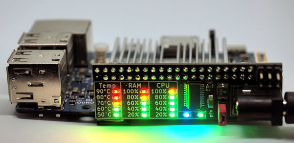
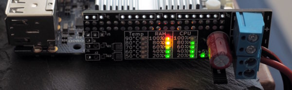

# PiStackMon

## What is it?

PiStackMon started off as a hardware module for distributing power to multiple stacked Raspberry Pi computers, rathen than handling multiple USB power adapters.

Over time, with its feature list open for new ideas, it grew into a highly integrated, multi purpose board with extended connectivity options.

The most eye catching feature is the live system monitor, with three most basic parameters (Temperature, RAM and CPU) clearly presented on a LED matrix. This helps quickly diagnosing performance bottlenecks by just looking at your cluster. LEDs are driven by a lightweight daemon, *pistackmond*, that compiles and runs on any target architecture.

PiStackMon comes with a variety of extra connectivity features, such as optically isolated outputs, isolated high current switches (up to 6A), dedicated fan output with suitable transistor, not to mention the usual I2C, UART or SPI.

Finally, PiStackMon allows you to power your SBC via GPIO pins, with additional polyfuse protection and a large capacitor, ensuring safe and stable operation. Screw terminals or barrel jack power inputs let you use any 5V power supply you wish, or even daisy chain a few units, thus sharing a common supply.

PiStackMon is compatible with any SBC following the RasPi GPIO layout. 

## Hardware

PiStackMon comes in two varieties, *lite* and *classic*.

### PiStackMon Lite



By popular demand, a new hardware version has been rolled out, offering the most useful subset of features seen in the Classic design. All mandatory SMD components are placed on top side, so the board may be ordered preassembled by JLCPCB. All required files are available in this repository.

The user is required to solder their own 40-pin socket, power switch pin header and power socket of their choice.

Features include:

- DC power input (either 5mm screw terminal or barrel jack)

- 2.5A Polyfuse protection

- 100uF ceramic capacitor

- Pin header for managing power supply (using a jumper or any other mechanical switch)

- 3x 5-LED indicators of real-time CPU usage, RAM usage and CPU temperature

- +5V LED indicator

- Extra user-programmable LED

- Soldering pads for accesing selected GPIOs:
  
  - I2C1
  
  - UART
  
  - GND, 3V3

- Two 0805 SMD placeholders for optional I2C1 pullup resistors


### PiStackMon Classic



The omnipotent, original design with all features available in the project. It is targeted at more advanced users, as no kits or preassembled units are available.

Alternatively, the schematic and KiCAD project files are available for reference. Feel free to modify it to suit your needs!

The design follows strict rules, so PCBs may be obtained for as low as 2 USD per 5 pieces at JLCPCB. 

- Supplying SBCs via screw terminals rather than USB port

- Dual power inputs-outputs allow clean and easy daisy-chaining

- 2.5A self-healing polyfuse protection 

- Bulk capacitor helps preventing transient undervoltage events

- Pin header for managing power supply (using a jumper or any other mechanical switch)

- +5V LED indicator

- 3x 5-LED indicators of real-time CPU usage, RAM usage and CPU temperature

- Auxiliary IOs for your projects:
  
  - SPI0, I2C1 and 1Wire easily accesible through 2.54mm headers
  
  - 1-Wire pullup resistor
  
  - 3-pin header with RC-filtered 3V3 supply for IR sensors
  
  - 2-pin header with 5V and BJT-reinforced low side switch, for PWM fan control
  
  - Two optically isolated outputs, for pulling external logic up or down (>2.5mA)
  
  - Two high-power, isolated low side switches, up to 26V and 6A
  
  - Alternatively, MCP1416s can be used as line drivers directly
  
  - Optical isolation lets you drive external circuits without creating ground loops
  
  - One isolated output and one high-power switch are connected to hardware PWM GPIO pins

- Low profile PCBs allow stacking with spacers as short as 20mm,

- No risk of contact with conductive stack spacers

- Components selected for low cost and relatively easy assembly (One TSSOP24 chip might be tricky)

- Alternative components are listed as well

- Modular design lets you build even cheaper boards without features you don't need


## Software

*pistackmond* is a lightweight daemon that's only purpose is to read system stats and drive PiStackMon LEDs. Additionally, it may be used by external software to drive the user-programmable LED available in PiStackMon Lite.

The recommended way to set up *pistackmond* on a target machine is to build it from source, in a few simple steps explained below. Alternatively, a DEB package may be built and distributed within your cluster.

*pistackmond* runs as a systemd service and has no dependencies outside standard C++ libraries. It has been tested on multiple Linux systems, including those based on Ubuntu, Debian or Arch.

#### Building pistackmond from source

- Log in to your SBC as any user with sudo access. 

- Install `git`, `g++` and `make`:
  
  - Debian, Ubuntu, RasPi OS etc:
    
    `sudo apt install git g++ make`
  
  - Arch, Manjaro and other derivatives:
    
    `sudo pacman -S git gcc make`

- Clone this repository:
  
  `git clone --depth 1 --branch main https://github.com/tomek-szczesny/pistackmon.git`

- Enter sw directory:
  
  - `cd pistackmon/sw`

- List build options to pick the right one for your SBC:
  
  - `make`

- Build pistackmond (Example for Raspberry Pi 4):
  
  - `make rpi4`

- Install and run systemd service
  
  - `sudo make install`


That's it! PiStackMon should start displaying your computer stats immediately.

#### Creating a DEB-Package

In case you don't want to have a compiler and source code on your
production machines, you can create a deb-package on one system and
install it on multiple other systems.

The recommended procedure is:

```
apt-get -y install checkinstall  # if not already installed
cd pistackmon/sw
make clean                       # in case you don't start from scratch
#edit the `makefile` and replace `PREFIX=/usr/local` with `PREFIX=/usr`
make rpi4
sudo ./make-deb rpi4
```

This will create a package named `pistackmond-rpi4...deb`.

To install this package, run

```
dpkg -i pistackmond-rpi4...deb
sudo systemctl start pistackmond.service
```

## Compatible SBCs

PiStackMon is electrically compatible with all SBCs that follow the RasPi 40-pin GPIO layout. However, explicit support must be implemented in *pistackmond* daemon for that to work.


| SBC            | Status     | Remarks                                                                                                                                    |
| -------------- | ---------- | ------------------------------------------------------------------------------------------------------------------------------------------ |
| Raspberry Pi 3 | Compatible |                                                                                                                                            |
| Raspberry Pi 4 | Compatible |                                                                                                                                            |
| Odroid N2(+)   | Compatible | Powering via PiStackMon is not supported. Any attempt will likely destroy your N2.                                                         |
| Odroid C1(+)   | Compatible | Temperature sensing not confirmed. OS must export CPU temperature to the following file: `/sys/devices/virtual/thermal/thermal_zone0/temp` |

Limited amount of free PiStackMon samples is available for testers and contributors for new platforms. Open an Issue to get in touch!


# Disclaimer

This hardware and software is provided as-is.
All hardware and software presented in this repository may pose hazard to humans, animals, plants, fungi, ghosts, spirits and hardware, and is not guaranteed to work at all.
DO NOT ATTEMPT TO MAKE ANY USE OF FILES PROVIDED IN THIS REPOSITORY.

Users agree to take full responsibility for their actions involving files in this repository.
Ask an expert before you mess with stuff you don't understand.

# 

# Building PistackMon Classic

This chapter will definitely need some love, but for now just be sure to follow a few guidelines off the top of my head:

- Decide which features you need or not. As a rule of thumb, you may ignore any boxed part of a schematic independently.
- Check the datasheet of your LEDs or experiment to determine what is the optimal driving current for them. Some LEDs need 1mA, some 10mA. There are no recommended LEDs for PiStackMon.
- If different colors of your LEDs of choice have different intensities, don't worry, there are const values in the code to compensate for that.
- "NM" resistors are simply Not Mounted - leave these places empty, unlesss you want to hack PiStackMon for other purposes.
- Before you do anything, just remember that 40-pin connector should be mounted as the very last component, after you make sure everything else works. Consider it a permanent component, because removing it is indeed a pain in the rectum.
- Mount everything you plan to include, except 40-pin connector and C1. Power up your SBC using its original power input. You may test PiStackMon by carefully connecting it to SBC's GPIO header directly, and applying some tension to ensure proper connection. It is a good idea to check if all LEDs work correctly and that you picked the right LED currents.
- After soldering, make sure you clean your board _very carefully_ from any traces of flux, especially under and around the LED driver chip. Dip it in pure alcohol for an hour if you have to. Failing to do so may make some LEDs glow even though these are supposed to be off.
- Place a tiny heatsink on a low side high-power switch MOSFET if you plan to thrash the living hell out of it.
